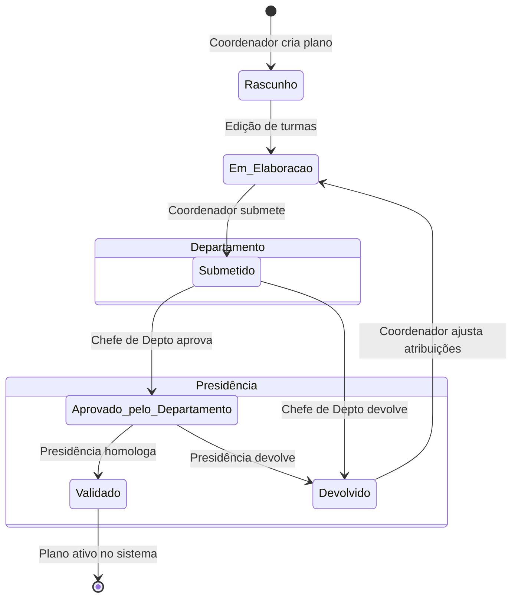
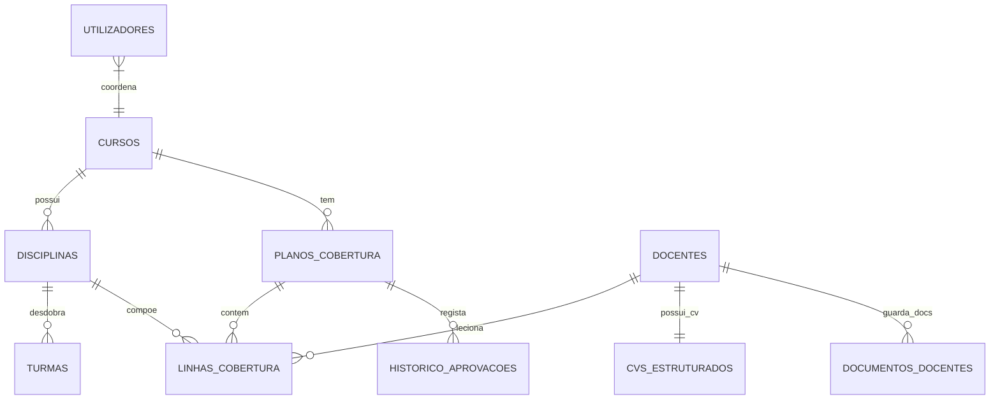

# Guia Funcional e Operacional do Sistema
## Módulo de Cobertura Docente & CV MESCTI — ISPSN

**Autor:** Evaristo Adriano  
**Instituição:** Instituto Superior Politécnico Sol Nascente (ISPSN)  
**Ano Lectivo de Referência:** 2026/27  

---

## 1. Visão Geral do Fluxo de Ponta a Ponta

Este documento descreve o funcionamento prático do **Módulo de Cobertura Docente e CV MESCTI**, cobrindo o percurso completo das informações desde o cadastro curricular até à aprovação final dos planos e transição de ano lectivo.

### 1.1. Ingestão da Estrutura Académica
O sistema organiza a oferta educativa em três níveis encadeados:
1. **Cursos e Matriz Curricular**: Os cursos (ex.: Direito, Enfermagem, Gestão de Recursos Humanos) contêm o elenco de disciplinas organizadas por ano curricular (1º ao 5º ano) e semestre (I, II ou Anual).
2. **Turmas Operacionais**: Cada disciplina desdobra-se em turmas específicas (ex.: turmas da manhã, pós-laboral ou sabatino). As turmas registam os indicadores de acompanhamento lectivo, como o total de sumários previstos e leccionados, o carregamento do programa e da dosificação, os prazos de pautas e os resultados das inquéritos pedagógicos.

### 1.2. Ficha de Docente e CV MESCTI
O formulário do docente divide-se em duas camadas:
- **Ficha Base**: Dados de identificação, grau académico (`Licenciado`, `Mestre`, `Doutor`), especialidade científica, estado de homologação no INAAREES e presença de capacitação pedagógica.
- **CV Estruturado em 4 Blocos**:
  - Bloco 1: Dados biográficos e contactos (BI, telefone, foto).
  - Bloco 2: Formação académica detalhada.
  - Bloco 3: Carreira docente, regime contratual (`Tempo Integral`, `Tempo Parcial`, `Colaborador`) e anos de experiência no ensino superior.
  - Bloco 4: Produção científica dos últimos três anos, linhas de investigação e histórico de disciplinas leccionadas.

Além dos campos formulados, o módulo disponibiliza um repositório documental para carregamento e validação visual de diplomas, certificados e comprovativos em PDF ou imagem.

### 1.3. Montagem do Plano de Cobertura
O Coordenador de Curso acede ao mapa de cobertura do seu curso para o ano lectivo ativo. Para cada turma e disciplina:
1. O sistema apresenta um seletor com ranking de compatibilidade de docentes.
2. O Coordenador pode atribuir um docente turma a turma ou utilizar o comando de propagação por disciplina, que aplica o mesmo docente a todas as turmas daquela cadeira no mesmo ano com uma única ação.
3. Enquanto está a ser trabalhado, o plano permanece nos estados temporários `Rascunho` ou `Em Elaboração`.

### 1.4. Avaliação Automática de Conformidade
Assim que um docente é alocado a uma turma, o backend determina o indicador de conformidade:
- **`Sim` (Conforme)**: Atribuído a Doutores, ou a Mestres com homologação INAAREES comprovada (`Sim`).
- **`Parcial` (Conformidade Condicionada)**: Atribuído a Mestres sem declaração INAAREES validada, ou a qualquer docente classificado no estado `Sobregregado` por leccionar em 3 ou mais cursos em simultâneo ou acumular mais de 20 horas semanais.
- **`Não` (Não Conforme)**: Atribuído a Licenciados sem autorização de exceção pedagógica.
- **`Por verificar`**: Turmas ainda sem docente atribuído.

Por cautela normativa, registos com declaração INAAREES ausente ("Sem declaração" ou "Não registado") são tratados por omissão como `Não` até que o documento comprovativo seja validado no repositório.

### 1.5. Fluxo de Submissão e Homologação
1. **Submissão**: Concluída a alocação, o Coordenador submete o plano (`Submetido`), bloqueando-o para novas edições locais.
2. **Apreciação do Departamento**: O Chefe de Departamento analisa o plano e decide entre aprovar (`Aprovado pelo Departamento`) ou devolver (`Devolvido`) indicando as observações de ajuste.
3. **Validação da Presidência**: A Presidência analisa os planos aprovados pelos departamentos. A validação (`Validado`) representa a homologação oficial da distribuição docente.

### 1.6. Transição de Ano Lectivo (Roll-Over)
No encerramento do ano académico, o Administrador executa a transição de ano lectivo. O procedimento duplica os planos do ano corrente para o ano seguinte no estado `Rascunho`, replicando as atribuições de disciplinas e turmas sem perda de dados nem duplicação de registos.

---

## 2. Workflow de Aprovação

### Permissões por Perfil de Acesso (RBAC)

| Perfil | Editar Rascunho | Submeter | Aprovar no Depto. | Validar na Presidência | Devolver |
|---|:---:|:---:|:---:|:---:|:---:|
| **Coordenador de Curso** | Sim | Sim | Não | Não | Não |
| **Chefe de Departamento** | Não | Não | Sim | Não | Sim |
| **Presidência / Direção** | Não | Não | Sim | Sim | Sim |
| **Gestão Académica** | Consulta | Não | Não | Não | Não |
| **GRH** | Consulta | Não | Não | Não | Não |
| **Administrador** | Sim | Sim | Sim | Sim | Sim |

---

## 3. Estrutura da Base de Dados

### 3.1. Tabelas Principais

- **`cursos`**: Cadastro dos cursos institucionais.
- **`disciplinas`**: Matriz curricular com semestre, ano e carga horária.
- **`docentes`**: Dados base do corpo docente (grau, especialidade, INAAREES, capacitação).
- **`turmas`**: Desdobramento das disciplinas por turno e acompanhamento pedagógico.
- **`planos_cobertura`**: Cabeçalho do plano por curso e ano lectivo.
- **`linhas_cobertura`**: Atribuição efetiva entre turma, disciplina e docente com o estado de conformidade.
- **`cvs_estruturados`**: Tabela 1:1 com `docentes` contendo os detalhes do CV MESCTI em formato JSON.
- **`documentos_docentes`**: Ficheiros anexados do docente (diplomas, certificados, BI).
- **`historico_aprovacoes`**: Registos inalteráveis das ações de submissão, aprovação e devolução.
- **`utilizadores`**: Contas de acesso e permissões associadas.

### 3.2. Relacionamento Simplificado (Diagrama ER)

---

## 4. Endpoints e Ações da API (`ApiController.php`)

Todas as operações de escrita e consulta AJAX utilizam o endpoint `public/index.php?api={action}`:

| Ação (`?api=...`) | Método | Descrição | Perfis Autorizados |
|---|:---:|---|---|
| `plano` | `GET` | Carrega o mapa de cobertura e linhas do curso | Autenticados |
| `linha_salvar` | `POST` | Grava a atribuição de docente numa linha | Coordenador, Admin |
| `linha_replicar_turmas` | `POST` | Aplica o docente a todas as turmas da disciplina | Coordenador, Admin |
| `sugerir_docentes` | `GET/POST` | Retorna ranking de docentes recomendados | Coordenador, Admin |
| `plano_estado` | `POST` | Altera estado do plano (Submeter, Aprovar, Devolver) | Chefe Depto, Presidente, Admin |
| `plano_historico` | `GET` | Consulta o histórico de decisões do plano | Autenticados |
| `cv_carregar` | `GET` | Retorna o CV completo e normalizado do docente | GRH, Admin, Docente |
| `cv_salvar` | `POST` | Grava o CV estruturado e propaga conformidades | GRH, Admin |
| `docentes` | `GET` | Lista e filtra o corpo docente | Autenticados |
| `docente_upload_documento` | `POST` | Anexa comprovativo documental em PDF/imagem | GRH, Admin |
| `exportar_excel` | `GET` | Gera ficheiro CSV/Excel do plano de cobertura | Autenticados |
| `executar_rollover` | `POST` | Duplica atribuições do ano letivo para o seguinte | Administrador |

---

## 5. Comportamentos Automáticos do Backend

1. **Propagação de Conformidade do CV**:
   Quando o GRH altera o grau académico ou estado INAAREES de um docente, o método `DocenteModel::saveCVCompleto` dispara automaticamente um recálculo nas linhas de cobertura de todos os planos ativos onde esse docente leciona.
2. **Atribuição em Lote por Cadeira**:
   Ao clicar em replicar por disciplina, o backend atualiza todas as turmas correspondentes dentro da mesma transação SQL, recalculando a conformidade individual de cada linha.
3. **Validação de Acesso por Curso**:
   O sistema verifica se o curso da linha que está a ser editada corresponde ao `curso_id` do coordenador ligado na sessão. Tentativas de alterar dados de outros cursos devolvem erro `HTTP 403`.
