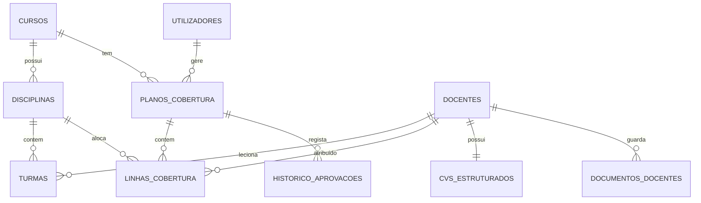

# Documento Técnico de Handover — Módulo de Cobertura Docente & CV MESCTI

**Instituição:** Instituto Superior Politécnico Sol Nascente (ISPSN)  
**Destinatário:** Equipa Técnica de Gestão Escolar (Dr. David Boio)  
**Arquitetura:** Opção A — Código e esquema integrados diretamente no sistema principal  
**Autor:** Evaristo Adriano  
**Data:** Agosto de 2026  

---

## 1. Contexto e Enquadramento Técnico

Este documento acompanha a entrega do código-fonte do **Módulo de Cobertura Docente e CV MESCTI**, adaptado para integração direta (Opção A) na infraestrutura e base de dados do sistema de Gestão Escolar do ISPSN.

Com a alteração de arquitetura — passando de um modelo de dois sistemas com sincronização remota via API para o modelo embutido no mesmo banco de dados —, eliminou-se a necessidade de chamadas HTTP, filas de sincronização e campos de controlo remoto (`sync_pendente`). O módulo passa a ler e escrever diretamente nas tabelas da instituição.

### Componentes Entregues
1. **Atribuição Curricular por Turma**: Mapeamento de docentes por disciplina e turma em cada ano lectivo.
2. **Avaliação de Conformidade MESCTI**: Regra em tempo real que cruza grau académico, homologação INAAREES, agregação pedagógica e carga horária acumulada.
3. **Ficha de CV Estruturado MESCTI**: Formulário em quatro blocos para cadastro detalhado da formação, carreira, publicações dos últimos três anos e histórico profissional.
4. **Workflow de Aprovação**: Ciclo de validação em três etapas (Coordenador ➔ Chefe de Departamento ➔ Presidência).
5. **Roll-Over de Ano Lectivo**: Algoritmo para transição automática de atribuições de um ano académico para o seguinte.

---

## 2. Dicionário de Dados e Integração com o Schema Existente

O módulo foi desenhado com 9 tabelas e 7 views SQL. Na integração com a base de dados de produção do Gestão Escolar, as tabelas core (`cursos`, `disciplinas`, `docentes`, `turmas`, `utilizadores`) devem reutilizar as tabelas equivalentes já existentes no sistema principal.



### Validação com a Amostra de Dados Reais da Instituição

A estrutura de campos da tabela `docentes` foi alinhada com os dados dos 258 docentes do ISPSN:

- **Grau Académico**: Os registos originais que continham menções a cursos em andamento (ex.: "Licenciado (mest. em curso)") foram padronizados para o grau efetivamente concluído (`Licenciado`, `Mestre`, `Doutor`).
- **Homologação INAAREES**: Na amostragem inicial registavam-se estados diversos como "Sem declaração" ou "Não registado". Por precaução normativa do MESCTI, a ausência de comprovativo anexado é tratada como `Não` até que o documento seja validado no repositório documental.
- **Estado de Capacidade (`estado_capacidade`)**: Não é uma coluna física na tabela `docentes`. É uma propriedade calculada em tempo real (via View SQL `vw_docentes_capacidade_carga` ou método no Model) com base no número de cursos em que o docente leciona (`nc >= 3`) e na carga horária semanal acumulada (`> 20h`).

---

## 3. Principais Métodos e Regras de Negócio

### 3.1. Matriz de Conformidade MESCTI

A atribuição de um docente a uma turma gera automaticamente um estado de conformidade com base no seguinte critério:

| Grau Académico | INAAREES | Capacidade / Carga | Conformidade | Justificação |
|---|---|---|---|---|
| Qualquer | Qualquer | Sobregregado (≥3 cursos ou >20h/sem) | `Parcial` | Penalização por excesso de carga lectiva |
| Doutor | Indiferente | Disponível / No Limite | `Sim` | Doutoramento confere conformidade plena |
| Mestre | Sim | Disponível / No Limite | `Sim` | Mestrado reconhecido pelo INAAREES |
| Mestre | Não | Disponível / No Limite | `Parcial` | Mestrado pendente de homologação |
| Licenciado | Qualquer | Disponível / No Limite | `Não` | Exige acompanhamento ou substituição |

#### Implementação de Referência (PHP)

```php
if ($docente['estado_capacidade'] === 'Sobregregado') {
    $conformidade = 'Parcial';
} elseif ($docente['grau_academico'] === 'Doutor') {
    $conformidade = 'Sim';
} elseif ($docente['grau_academico'] === 'Mestre' && $docente['tem_inaarees'] === 'Sim') {
    $conformidade = 'Sim';
} elseif ($docente['grau_academico'] === 'Mestre') {
    $conformidade = 'Parcial';
} else {
    $conformidade = 'Não';
}
```

---

### 3.2. Gravação de CV e Atualização em Cascata

**Método:** `DocenteModel::saveCVCompleto(int $docenteId, array $data)`

Ao guardar o CV de um docente no formulário do GRH, a operação corre dentro de uma transação SQL em três etapas:
1. Atualização dos campos de registo na tabela `docentes` (`grau_academico`, `especialidade`, `tem_inaarees`, `tem_agregacao_pedag`, `categoria_carreira`).
2. Salvamento dos dados detalhados na tabela `cvs_estruturados` (convertendo formações, experiências e publicações para campos JSON).
3. Execução de `recalcularConformidadeDocenteEmTodosPlanos($docenteId)`, que atualiza instantaneamente as linhas de cobertura de todos os cursos onde o docente está alocado.

---

### 3.3. Transição de Ano Lectivo (Roll-Over)

**Método:** `PlanoModel::executarRollOver(string $anoOrigem, string $anoDestino, ?int $userId)`

Para evitar o trabalho repetitivo de recriar as atribuições ano a ano, o método de Roll-Over duplica a estrutura do ano anterior:
1. Percorre todos os cursos ativos com plano no ano de origem.
2. Cria os novos planos no ano de destino com o estado inicial `Rascunho`.
3. Copia todas as linhas de atribuição (`disciplina_id`, `turma_id`, `docente_id`, `regime`, `parecer`), recalculando a conformidade para o novo período.
4. Regista o evento na tabela `historico_aprovacoes` para efeitos de auditoria.

---

## 4. Recomendações para a Equipa de Integração

Ao integrar estes ficheiros no código-fonte do Gestão Escolar, recomendamos atenção aos seguintes pontos:

1. **Mapeamento de Chaves Estrangeiras**:
   - `docente_id` no módulo ➔ apontar para a tabela de professores do Gestão Escolar.
   - `disciplina_id` no módulo ➔ apontar para a tabela de disciplinas.
   - `curso_id` no módulo ➔ apontar para a tabela de cursos.
   - `turma_id` no módulo ➔ suporta `VARCHAR(50)` para alinhar com os códigos das turmas (ex.: `ACSP1MA`).
2. **Controlo de Acesso (RBAC)**:
   - Garantir que as sessões de utilizador definam o perfil (`perfil`) e o curso associado (`curso_id`), respeitando as permissões de edição de coordenadores e chefe de departamento.

---

## 5. Código Obsoleto da Opção B Removido

Na mudança para a Opção A, os componentes construídos exclusivamente para comunicação remota foram removidos do pacote entregue:
- Removido o serviço de sincronização `GestaoEscolarSyncService.php`.
- Removidos endpoints de API remota (`sincronizar_gestao_escolar`, `testar_conexao_gestao_escolar`, `planos_sync_pendentes`, `reenviar_push_plano`).
- Removida a coluna `sync_pendente` da tabela `planos_cobertura` e métodos de consulta remota do `PlanoModel.php`.
- Removidas as variáveis de configuração de API remota no `config/config.php`.
